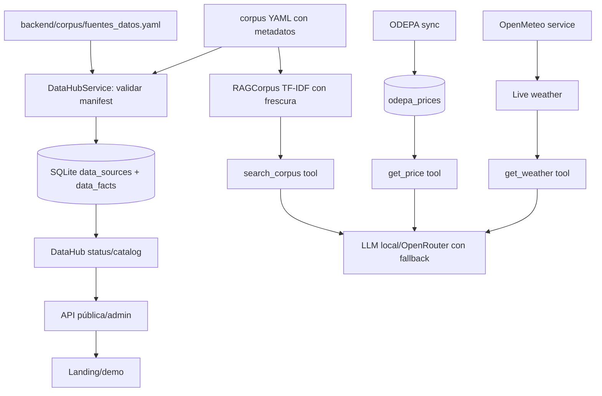

# Design — agrovoz-data-ecosystem

## Meta

- **Feature:** agrovoz-data-ecosystem
- **Author:** spec-author
- **Status:** approved for implementation
- **Date:** 2026-08-13
- **Spec:** `specs/agrovoz-data-ecosystem/requirements.md`

## Summary

El Data Hub agrega metadatos y control operacional alrededor de los servicios actuales. Un manifest declarativo describe fuentes oficiales; la sincronización local valida e ingiere snapshots YAML en `data_sources`/`data_facts`; el RAG indexa documentos con vigencia y procedencia; APIs y un fast path determinista entregan el catálogo. El request conversacional no descarga fuentes externas nuevas.

## Technical Context

| Field | Value |
|---|---|
| **Language/Version** | Python 3.12+ / TypeScript Astro 7 |
| **Primary Dependencies** | FastAPI 0.115+, SQLAlchemy 2.0+, Alembic, Pydantic, PyYAML, scikit-learn existente |
| **Storage** | SQLite existente, dos tablas nuevas y corpus YAML versionado |
| **Testing** | pytest, pytest-asyncio, coverage, ruff, mypy strict, Astro/Bun build |
| **Target Platform** | VPS Docker con 1 vCPU / 4 GB RAM; WhatsApp y PWA opcional |
| **Project Type** | Backend monolítico modular + landing Astro |
| **Performance Goals** | Data Hub local p95 <500 ms; E2E de AgroVoz <15 s |
| **Constraints** | Sin DB separada, Redis, Celery, app nativa, IoT o API paga obligatoria |
| **Scale/Scope** | Decenas de fuentes, miles de hechos; snapshots pequeños y deduplicados |

## Constitution Check

| Principle | Status | Evidence |
|---|---|---|
| Fuentes oficiales/citas | ✅ | Manifest + columnas de URL/fecha + tests de trazabilidad |
| Fail closed | ✅ | Validación de fechas, estados y no connected |
| WhatsApp/local fallback | ✅ | Integración sin dependencia externa en la ruta de respuesta |
| Privacidad | ✅ | Hechos separados de PII; endpoints públicos read-only |
| Rendimiento | ✅ | TF-IDF local existente; top-k 3; sin red en búsqueda |
| Simplicidad | ✅ | Sin nuevas dependencias; dos modelos y servicios acotados |

## Technical Decisions

| Decision | Rejected Alternative | Reason |
|---|---|---|
| Dos tablas `data_sources`/`data_facts` | JSON gigante en una sola fila | Permite índices, deduplicación y estado operativo verificable. |
| Manifest YAML versionado | Configurar fuentes solo en `.env` | La procedencia/cobertura es auditable y revisable en código. |
| TF-IDF local enriquecido | Vector DB/embeddings remotos | Menor coste, determinismo y compatibilidad con hardware mínimo. |
| Sync manual/admin + snapshots | Descargar todo al iniciar FastAPI | El arranque no debe depender de red ni bloquear readiness. |
| Fuentes no conectadas explícitas | Exponerlas como “disponibles” | Evita alucinación y promesas de integración sin adaptador. |
| Fast path de capacidades | Agregar otra tool al prompt | Evita gastar el presupuesto de contexto para una respuesta de catálogo determinista. |

## Architecture



## Data Model

### `data_sources`

- `id`: integer primary key.
- `key`: string(80), unique, stable manifest identifier.
- `name`, `organization`, `category`, `mode`, `url`, `license`, `refresh_policy`, `coverage`, `schema_version`: required metadata.
- `enabled`: boolean; `status`: `healthy`, `stale`, `error`, `disabled`, `not_connected`.
- `last_attempt_at`, `last_success_at`, `valid_until`: nullable timestamps/ISO dates.
- `record_count`: integer non-negative; `content_hash`: nullable SHA-256.
- `last_error_code`: nullable bounded string; created/updated timestamps.

### `data_facts`

- `id`: integer primary key.
- `source_key`: indexed string(80), logical FK to manifest key; no DB FK to permit catalog upsert order.
- `domain`: indexed string(40); `subject`: string(160); optional `location`, `product`.
- `title`, `text`, `source_url`, optional `source_date`, `verified_on`, `review_before`.
- `fact_hash`: unique SHA-256 of source/key/normalized content.
- created/updated timestamps.

`data_facts` no contiene `phone_number`, `user_id`, audio, transcript, consent, parcela ni gasto. El vínculo con fuentes es lógico y se valida en servicio para que una fuente eliminada no deje hechos servibles.

## Project Structure

```text
backend/
├── app/models/data_hub.py                 # DataSource y DataFact
├── app/schemas/data_hub.py                # contratos API
├── app/services/data_hub_service.py       # manifest, sync, status, catálogo
├── app/api/data_hub.py                    # catálogo/search público read-only
├── app/api/admin/data_hub.py              # status/sync admin
├── corpus/fuentes_datos.yaml              # registry de fuentes
├── migrations/versions/*_data_hub.py     # migración SQLite
└── tests/test_data_hub_service.py        # tests de contrato y frescura

landing/src/pages/index.astro              # sección de ecosistema y fuentes
specs/agrovoz-data-ecosystem/              # trazabilidad SDD
```

**Structure Decision:** El Data Hub vive como servicio transversal en `app/services` y no reemplaza `odepa_service`, `weather_service`, `alert_service` ni `rag_service`; cada dominio conserva sus validaciones y el Hub agrega catálogo/procedencia.

## Dependencies

| Dependency | Version | Purpose |
|---|---|---|
| SQLAlchemy | existente 2.0+ | Persistencia de estado y hechos |
| Alembic | existente | Migración reproducible |
| PyYAML | existente | Lectura del manifest/corpus |
| scikit-learn | existente | TF-IDF local del RAG |
| FastAPI/Pydantic | existente | APIs y contratos |

No se agrega dependencia nueva.

## Complexity Tracking

No hay violaciones de la constitución. Las fuentes no conectadas se modelan explícitamente para cumplir fail-closed, no como una capacidad falsa.

## Risks

| Risk | Mitigation |
|---|---|
| Snapshot queda vencido | `review_before` + filtro estricto + estado `stale`. |
| YAML corrupto | Validación antes de upsert y preservación de última carga válida. |
| Doble sync | Hash único, upsert idempotente y transacción. |
| Metadata incompleta en corpus antiguo | Defaults controlados y estado no conectado si falta procedencia obligatoria. |
| Confusión entre catálogo y dato live | `mode`/`status` visibles en API, tool y landing. |
| Persistencia accidental de PII | Modelo separado, schemas cerrados y tests de campos. |
| Activación prematura de capacidades sensibles | Se mantienen feature gates existentes; el registro no las modifica. |

## References

- `docs/ARCHITECTURE.md`
- `backend/app/core/database.py`
- `backend/app/services/rag_service.py`
- `backend/app/api/admin/odepa_admin.py`
- `backend/migrations/env.py`
