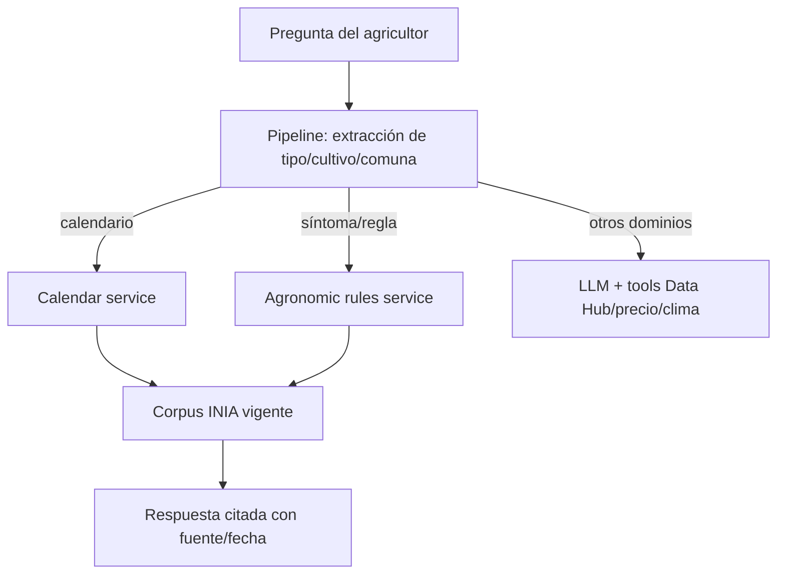

# Design — ai-agronomic-guidance

## Meta

- **Feature:** ai-agronomic-guidance
- **Author:** Sebastian Bravo / Codex
- **Status:** ready
- **Date:** 2026-08-14
- **Spec:** `specs/ai-agronomic-guidance/requirements.md`

## Summary

Activar la capacidad conversacional existente sin crear otra capa generativa:
el pipeline identifica consultas agronómicas y resuelve calendario/reglas de
forma determinista; el LLM solo queda para otras consultas o para verbalizar
cuando corresponda.

## Technical Context

| Field | Value |
|---|---|
| **Language/Version** | Python 3.12, FastAPI, Astro |
| **Primary Dependencies** | Pydantic, SQLAlchemy, llama-cpp/OpenRouter, YAML corpus |
| **Storage** | Corpus YAML versionado; sin migración nueva |
| **Testing** | pytest/pytest-asyncio, ruff, mypy, smoke demo |
| **Target Platform** | WhatsApp + PWA demo, Docker 1 vCPU/4 GB |
| **Project Type** | Asistente conversacional agrícola |
| **Performance Goals** | E2E <15 s; recomendación determinista sin LLM |
| **Constraints** | Fuente/fecha obligatorias; fail-closed; sin datos personales |
| **Scale/Scope** | Reglas actuales de papa y calendario INIA del piloto |

## Constitution Check

| Principle | Status | Evidence |
|---|---|---|
| Solo recomendaciones citadas | ✅ | Servicios deterministas y corpus vigente. |
| Fallback local | ✅ | No depende de OpenRouter para orientar. |
| Privacidad | ✅ | No agrega PII ni solicita identidad. |
| Hardware mínimo | ✅ | Reduce el camino a lectura local y no suma modelo. |

## Technical Decisions

| Decision | Rejected Alternative | Reason |
|---|---|---|
| Reusar fast path y tools existentes | Otro agente generativo de recomendaciones | Menor latencia y evita alucinaciones. |
| Gate explícito por ambiente | Activar desde cualquier request | Permite rollback y evita activar capacidades sin configuración. |
| Corpus versionado | Dataset gigante de fine-tuning | Trazabilidad, frescura y licencia. |

## Architecture



## Data Model

No hay cambios de esquema. Las interfaces existentes siguen siendo
`get_agronomic_rule_for_llm(sintoma, cultivo)` y
`get_calendario_agricola(producto, comuna)`, ambas retornan texto citado o
fallback seguro.

## Project Structure

```text
specs/ai-agronomic-guidance/ — trazabilidad SDD de esta activación
backend/app/services/prompt_builder.py — reglas de comportamiento del LLM
backend/app/services/llm_service.py — prompt remoto y tools gated
backend/app/services/pipeline_service.py — fast path determinista
backend/corpus/*.yaml — reglas y calendario con fuente/fecha
backend/tests/ — regresiones de servicio, pipeline y prompt
```

**Structure Decision:** reutilizar los servicios existentes; solo se agregan
spec, configuración, prompt, tests y documentación de activación.

## Dependencies

| Dependency | Version | Purpose |
|---|---|---|
| Ninguna | — | No se agrega dependencia. |

## Risks

| Risk | Mitigation |
|---|---|
| Corpus vencido | Validación de `revisar_antes_de` y fallback cerrado. |
| Prompt contradice las tools | Tests de texto para prompt local/remoto. |
| Activación accidental | Gate por ambiente y default de `Settings` cerrado. |
| Cobertura territorial insuficiente | No extrapolar comuna/zona. |

## References

- `backend/app/services/pipeline_service.py`
- `backend/app/services/agronomic_rules_service.py`
- `backend/app/services/agricultural_calendar_service.py`
- `backend/app/services/llm_service.py`
