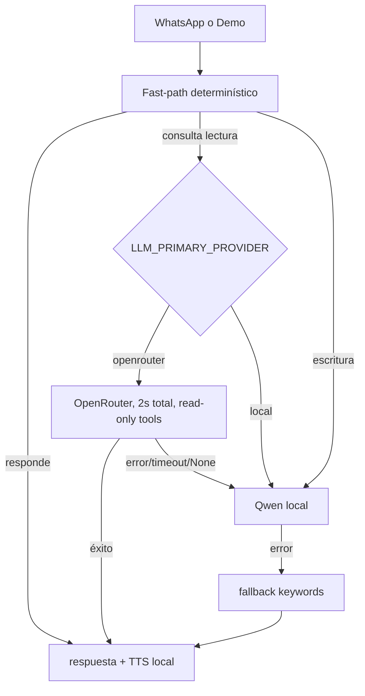

# Design — global-llm-provider-order

## Meta

- **Feature:** global-llm-provider-order
- **Author:** Codex
- **Status:** approved
- **Date:** 2026-08-11
- **Spec:** `specs/global-llm-provider-order/requirements.md`

## Summary

`answer_with_provider_order()` centraliza el orden de proveedores para la demo
y WhatsApp. Con `LLM_PRIMARY_PROVIDER=openrouter`, intenta
`answer_via_openrouter()` bajo `asyncio.wait_for` con deadline total de 2s,
policy de lectura y tool obligatoria. Si no hay resultado, llama `answer()` local.
Las consultas mutables se saltan OpenRouter; el fallback keyword existente queda
al nivel del pipeline.

## Technical Context

| Field | Value |
|---|---|
| Language/Version | Python 3.12+ |
| Dependencies | FastAPI, pydantic-settings, httpx, pytest, ruff, mypy |
| Storage | SQLite sin migraciones |
| Testing | pytest + pytest-asyncio + pytest-cov; `make test` |
| Runtime | Docker Compose dev/prod, FastAPI, WhatsApp y demo |
| Performance | Fast-path antes de LLM; deadline remoto 2.0s total; max 120 tokens |
| Constraints | Qwen local disponible; secrets fuera de git; no tools mutables remotas |

## Architecture



## Components

- `Settings`: `llm_primary_provider`, `openrouter_primary_timeout_seconds` y
  parámetros existentes.
- `OpenRouterPolicy`: limita tools y exige tool call en el intento primario.
- `answer_via_openrouter`: conserva loop, history, cultivos, tip y consulta.
- `answer_with_provider_order`: deadline, orden y origen (`openrouter`/`llm`).
- `pipeline_service`: consume orquestador y conserva fallback determinista.
- `demo_service`: consume el mismo orquestador; no tiene provider propio.

## Data Model

No hay cambios de schema. Settings:

```text
LLM_PRIMARY_PROVIDER: Literal["openrouter", "local"] = "openrouter"
OPENROUTER_PRIMARY_TIMEOUT_SECONDS: float = 2.0 (0.1..5.0)
OPENROUTER_MAX_OUTPUT_TOKENS: int = 120 (32..512)
```

## Safety Boundary

`OPENROUTER_PRIMARY_READ_ONLY_TOOLS` excluye `register_expense`,
`register_parcela`, `get_link_resumen` y `get_reporte_pdf`. Además, marcadores
deterministas (`registr`, `gasto`, `parcela`, `reporte`, etc.) saltan el remoto
primario. Esto es defensa en profundidad; las tools no se confían al prompt.

## Rollback

Cambiar `LLM_PRIMARY_PROVIDER=local` y reiniciar backend. Ese modo fuerza solo
Qwen aunque la key siga configurada; retirar la key elimina también el intento
remoto del modo primario.

## Risks

| Risk | Mitigation |
|---|---|
| OpenRouter lento/caído | Deadline total y Qwen local. |
| Respuesta remota sin grounding | `require_tool_call=True`; si no usa tool, Qwen. |
| Escritura duplicada | Tools mutables excluidas y comandos saltan remoto. |
| Privacidad/rate limit | Configuración explícita, documentación y rate limit existente. |
